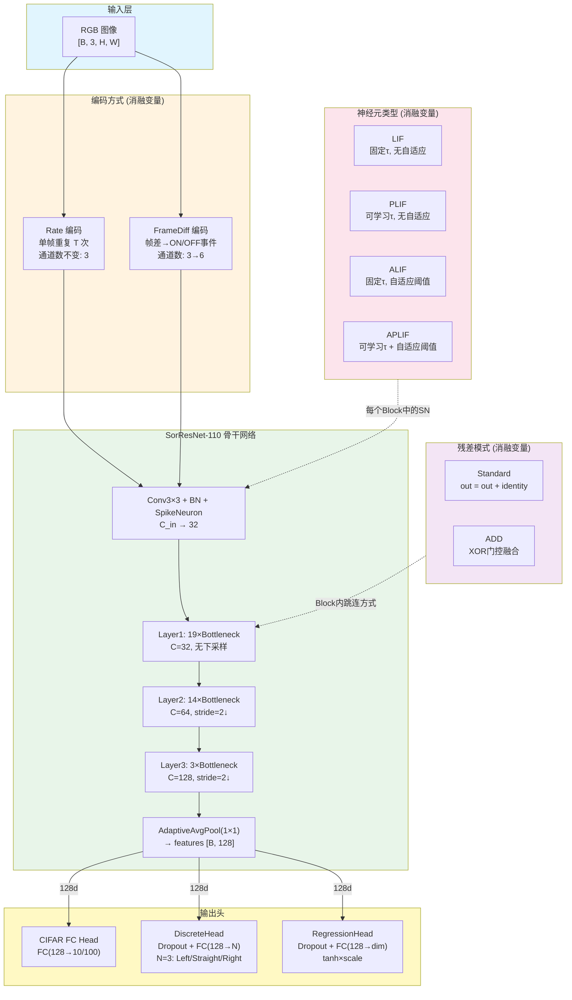
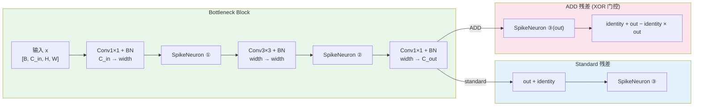
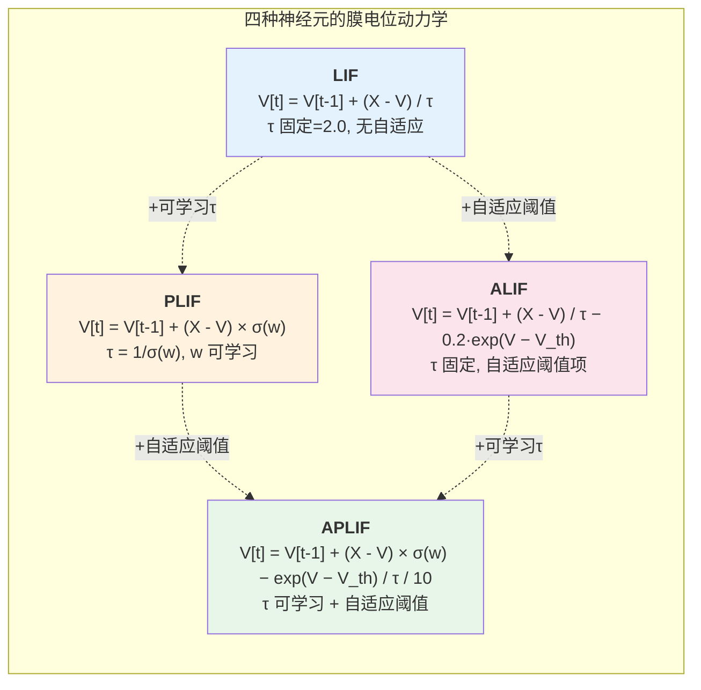

# SNN 消融实验 — 模型架构与组织

## 1. 架构总览

系统采用 **SorResNet-110** 作为视觉骨干网络，针对 CIFAR-10 分类和走廊导航两个任务构建不同的网络结构。消融实验围绕 **4 个独立变量** 展开：神经元类型、残差模式、时间步数、输入编码方式。



---

## 2. 消融变量一览

| 消融变量 | 选项 | 网络影响 | 命令行参数 |
|---------|------|---------|-----------|
| **神经元类型** | LIF / PLIF / ALIF / APLIF | 每个 Block 内脉冲神经元的动力学方程改变 | `--neuron_type` |
| **残差模式** | standard / ADD | Block 内跳跃连接的融合方式改变 | `--residual_mode` |
| **时间步数 T** | 1 ~ 16 | Rate 编码的重复次数，影响脉冲积累精度 | `-T` |
| **输入编码** | rate / framediff | 输入通道数 (3 vs 6)、是否跨帧保持状态 | `--encoding` |

---

## 3. 骨干网络 SorResNet-110

### 3.1 网络层结构

```
┌──────────────────────────────────────────────────────────────┐
│  SorResNet-110 (Block = Bottleneck, expansion = 4)           │
├──────────────────────────────────────────────────────────────┤
│                                                              │
│  Stem:  Conv3×3(C_in, 32) + BN + SpikeNeuron               │
│         输出: [B, 32, H, W]                                  │
│                                                              │
│  Layer1: 19 × Bottleneck(32→32, stride=1)                   │
│          每个 Block: 3 个 SpikeNeuron                        │
│          总: 57 个神经元                                      │
│          输出: [B, 32×4=128, H, W]                           │
│          注: 首个 Block 因 inplanes≠planes×4 有 downsample   │
│                                                              │
│  Layer2: 14 × Bottleneck(128→64, stride=2)                  │
│          每个 Block: 3 个 SpikeNeuron                        │
│          总: 42 个神经元                                      │
│          输出: [B, 64×4=256, H/2, W/2]                      │
│                                                              │
│  Layer3: 3 × Bottleneck(256→128, stride=2)                  │
│          每个 Block: 3 个 SpikeNeuron                        │
│          总: 9 个神经元                                       │
│          输出: [B, 128×4=512, H/4, W/4]                     │
│                                                              │
│  AdaptiveAvgPool(1, 1) → Flatten → [B, 512]                │
│                                                              │
│  FC Head: Linear(512, num_classes, bias=False)              │
│                                                              │
│  总脉冲神经元: 1(stem) + 57 + 42 + 9 = 109 个              │
└──────────────────────────────────────────────────────────────┘
```

### 3.2 时间步展开 (Rate 编码)

```
t=0: input → Conv+BN → SN → Layer1 → Layer2 → Layer3 → out_spike
t=1: input → Conv+BN → SN → Layer1 → Layer2 → Layer3 → out_spike (累加)
...
t=T-1: 同上 (累加)

final_out = out_spike / T → AvgPool → FC
```

> 注意：Conv+BN 的输出在所有时间步中共享（因为输入是静态图像），只有脉冲神经元的状态在时间步之间累积。

---

## 4. 残差模式对比

### 4.1 Bottleneck Block 内部结构



### 4.2 公式对比

| 残差模式 | 融合公式 | 特点 |
|---------|---------|------|
| **Standard** | $\text{out} = \text{SN}_3(\text{conv\_out} + \text{identity})$ | 经典加法残差，脉冲后置 |
| **ADD** | $\text{out} = \text{identity} + \text{SN}_3(\text{conv\_out}) - \text{identity} \times \text{SN}_3(\text{conv\_out})$ | 类 OR 门控，更适合二值脉冲 |

ADD 模式的完整流程（无 downsample 时）：
1. 中间门控：$\text{out}_1 = \text{out} + \text{identity} - 2 \times \text{out} \times \text{identity}$ （XOR-like）
2. 再过 Conv2+BN+SN
3. 最终融合：$\text{result} = \text{identity} + \text{out} - \text{identity} \times \text{out}$ （OR-like）

---

## 5. 神经元类型对比

### 5.1 演进关系



### 5.2 详细对比

| 属性 | LIF | PLIF | ALIF | APLIF |
|------|-----|------|------|-------|
| **来源** | spikingjelly 内置 | spikingjelly 内置 | 自定义 `ALIFNode` | 自定义 `APLIFNode` |
| **τ (时间常数)** | 固定 = 2.0 | 可学习: $\tau = 1/\sigma(w)$ | 固定 = 2.0 | 可学习: $\tau = 1/\sigma(w)$ |
| **自适应阈值** | 无 | 无 | $-0.2 \cdot e^{(V - V_{th})}$ | $-e^{(V - V_{th})} / \tau / 10$ |
| **每神经元可学参数** | 0 | 1 (w) | 0 | 1 (w) |
| **全网额外参数** | 0 | 109 | 0 | 109 |
| **梯度函数** | ATan | ATan | ATan | ATan |
| **detach_reset** | True | True | True | True |
| **表达能力** | 最低 | 中等 | 中等 | **最高** |

> 自适应阈值的作用：当膜电位接近阈值时，$e^{(V - V_{th})}$ 项会提供抑制力，防止持续高频放电，提升稀疏性。

---

## 6. 输入编码对比

### 6.1 Rate 编码

```
单帧输入 [B, 3, H, W]
         ↓ (直接输入)
    SorResNet 内部循环 T 次
         ↓
    out_spike / T → features [B, 512]
```

- 通道数不变 (3)
- backbone 内部 T 步展开
- 推荐 T ≥ 4

### 6.2 FrameDiff 编码

```
前帧 I_{t-1}  当前帧 I_t
         ↓          ↓
    diff_pos = ReLU(I_t - I_{t-1})   → ON 事件
    diff_neg = ReLU(I_{t-1} - I_t)   → OFF 事件
         ↓
    concat → [B, 6, H, W]
         ↓
    SorResNet (T=1)
         ↓
    features [B, 512]
```

- 通道数: 3 → 6
- 推荐 T = 1（帧差本身已编码时间信息）
- SNN 状态跨帧累积，不在帧间 reset

---

## 7. 任务架构

### 7.1 CIFAR-10/100 分类

```
┌─────────────────────────────────────────────────┐
│  CIFAR-10/100 Pipeline                          │
│                                                 │
│  Input: [B, 3, 32, 32]                         │
│           ↓                                     │
│  SorResNet-110 (含内置 FC 分类头)               │
│    backbone (Rate编码, T步展开)                  │
│           ↓                                     │
│  Output: logits [B, 10] 或 [B, 100]            │
│                                                 │
│  Loss: MSE-OneHot (带类别权重)                  │
└─────────────────────────────────────────────────┘
```

### 7.2 走廊导航 — 离散分类

```
┌─────────────────────────────────────────────────┐
│  CorridorPolicyNet (discrete)                   │
│                                                 │
│  Input: [B, 3, H, W] (默认 32×32, 可指定)      │
│           ↓                                     │
│  [编码: rate 或 framediff]                      │
│           ↓                                     │
│  SorResNet-110 backbone (return_features=True)  │
│           ↓ features [B, 512]                   │
│  DiscreteHead: Dropout(0.3) + FC(512→3)        │
│           ↓                                     │
│  Output: logits [B, 3] (Left/Straight/Right)   │
│                                                 │
│  Loss: CrossEntropyLoss (可选类别权重/采样器)   │
└─────────────────────────────────────────────────┘
```

### 7.3 走廊导航 — 连续回归

```
┌─────────────────────────────────────────────────┐
│  CorridorPolicyNet (regression)                 │
│                                                 │
│  Input: [B, 3, H, W]                           │
│           ↓                                     │
│  [编码: rate 或 framediff]                      │
│           ↓                                     │
│  SorResNet-110 backbone (return_features=True)  │
│           ↓ features [B, 512]                   │
│  RegressionHead: Dropout(0.3) + FC(512→dim)    │
│  + tanh × scale                                 │
│           ↓                                     │
│  Output:                                        │
│    dim=1: angular_z [B, 1] (×2.84 rad/s)       │
│    dim=2: [v, w] [B, 2] (×0.22, ×2.84)        │
│                                                 │
│  Loss: SmoothL1Loss (Huber, β=0.1)             │
└─────────────────────────────────────────────────┘
```

---

## 8. 消融实验矩阵

### 8.1 核心消融 (CIFAR-10)

| 实验编号 | neuron_type | residual_mode | T | 目的 |
|---------|------------|---------------|---|------|
| C1 | LIF | standard | 8 | 基线 |
| C2 | PLIF | standard | 8 | 可学习 τ 的影响 |
| C3 | ALIF | standard | 8 | 自适应阈值的影响 |
| C4 | **APLIF** | standard | 8 | 两者结合 |
| C5 | APLIF | **ADD** | 8 | ADD 残差的影响 |
| C6 | LIF | ADD | 8 | ADD + 简单神经元 |

对应命令示例：
```bash
# C1: 基线
python train.py -T 8 --neuron_type LIF --residual_mode standard --seed 42

# C5: APLIF + ADD (推荐配置)
python train.py -T 8 --neuron_type APLIF --residual_mode ADD --seed 42
```

### 8.2 走廊导航消融

| 实验编号 | neuron_type | residual_mode | encoding | T | head | 目的 |
|---------|------------|---------------|----------|---|------|------|
| N1 | APLIF | ADD | rate | 4 | discrete | 推荐基线 |
| N2 | LIF | ADD | rate | 4 | discrete | 神经元消融 |
| N3 | APLIF | standard | rate | 4 | discrete | 残差消融 |
| N4 | APLIF | ADD | framediff | 1 | discrete | 编码消融 |
| N5 | APLIF | ADD | rate | 8 | discrete | 时间步消融 |
| N6 | APLIF | ADD | rate | 4 | regression | 任务消融 |

对应命令示例：
```bash
# N1: 推荐基线
python train.py --dataset corridor --corridor_root ./data/corridor \
  --mode discrete --action_set 3 --encoding rate -T 4 \
  --neuron_type APLIF --residual_mode ADD \
  --class_balance weighted_sampler -b 32 -epochs 81 \
  --img_h 64 --img_w 96 --final_test --seed 42

# N4: 编码消融 (framediff)
python train.py --dataset corridor --corridor_root ./data/corridor \
  --mode discrete --action_set 3 --encoding framediff -T 1 \
  --neuron_type APLIF --residual_mode ADD \
  --class_balance weighted_sampler -b 32 -epochs 81 \
  --img_h 64 --img_w 96 --final_test --seed 42
```

---

## 9. 文件组织

```
ADD_ResNet110.py         ← SorResNet 骨干 (含 BasicBlock/Bottleneck/工厂函数)
neuron_model.py          ← ALIFNode / APLIFNode / build_neuron() 工厂
models/
  __init__.py
  snn_corridor.py        ← CorridorPolicyNet / FrameDiffEncoder / 输出头
train.py                 ← 统一训练入口 (v2, 支持 CIFAR + 走廊)
datasets/
  corridor_dataset.py    ← 走廊数据集加载器
```
